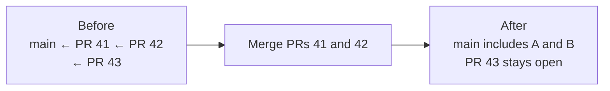

`merge` asks GitHub to merge your ready pull requests, starting at the bottom of your stack. After
GitHub finishes, `sync` brings your local stack and your remaining pull requests and review
branches up to date.

## Before merging

If you rewrote one of your changes after submitting it, submit your stack again, even if that
change's diff is unchanged:

```console
jj-stack submit <head-change-id>
jj-stack merge <head-change-id>
```

`merge` checks that each of your local changes still matches the commit you last submitted and
that none of your review branches or pull requests has moved unexpectedly.

## Choose how much of your stack to merge

By default, `merge` starts with the pull request at the bottom of your stack—the one based on
trunk—and works upward. It merges your ready pull requests in order until your whole stack is
merged or it reaches one of your changes that it cannot merge.

To merge only the bottom portion of your stack, specify its last change by change ID, commit ID,
or pull request ID:

```console
jj-stack merge --pull-request 42
```

PRs 41 and 42 merge; PR 43 stays open and is updated to start from the new main branch:



## Finish after GitHub merges

After GitHub merges some or all of your pull requests, `sync` fetches trunk, removes the merged
changes from your local history if needed, rebases your remaining changes, updates your remaining
pull requests, and removes your review branches when they are no longer needed.

What does “removes the merged changes from your local history” mean? If GitHub uses a merge
commit or rebase merge for your pull requests, it preserves their `jj` change IDs, and
`jj git fetch` gets your local history right. A squash merge drops those change IDs. After you
fetch, your local history therefore contains both the old changes and the squashed version on
trunk. `sync` discards the old changes for you.

### Direct merges

For a direct merge, `merge` waits for GitHub to finish and runs `sync` before it returns. You do
not need to run another cleanup command.

### Merge queues

When `merge` uses a merge queue, it returns successfully once GitHub accepts your selected pull
requests into the queue. This does not mean trunk has changed. Wait until GitHub reports that
your stack has merged. Then run `sync` with the head of your stack:

```console
jj-stack sync <head-change-id>
```

If you run either command while one of your selected pull requests is queued, `submit` and `sync`
leave your stack unchanged.

### Merges outside jj-stack

If you or someone else merged your stack through the GitHub UI, `gh`, or another client, run the
same `sync` command after GitHub reports that the merge finished.

### Rebasing from GitHub

GitHub's **Rebase stack** action rewrites every review branch onto the latest trunk. After it
finishes, run:

```console
jj-stack sync <head-change-id>
```

GitHub does not retain jj change IDs in those rewritten commits. `sync` verifies that the PRs,
branch order, and contents still match your submitted stack, rebases the original local changes,
and updates the review branches with commits that retain their change IDs. It stops if local
edits or GitHub content differ.

### Several merged stacks

If completed merges affected several local stacks, you can check every pull request that jj-stack
knows about without naming the stack heads individually:

```console
jj-stack sync --all
```

This finds each local stack affected by a completed merge and applies the normal `sync` workflow
to it. It also removes branches, comments, and saved pull-request links for merged reviews whose
local changes are gone. If one stack cannot be updated, jj-stack explains why and continues with
independent stacks.

Like selected `sync`, `sync --all` does not rebase a stack merely because trunk advanced. A
selected `sync` also recognizes a completed native GitHub stack rebase because GitHub moved every
review branch and the rewritten contents can be verified.

## If `merge` fails after GitHub merges your pull requests

This should be rare, but might happen if your network connection is interrupted or your power
fails.

There is no need to run `merge` again. Your pull requests are already merged. Finish your local
update and GitHub cleanup with the command printed by the diagnostic, normally:

```console
jj-stack view <head-change-id>
jj-stack sync <head-change-id>
```

`sync` checks the current local and GitHub state each time, so there is no separate resume
command.

## When trunk moves without one of your pull requests merging

`sync` is for cleaning up after completed GitHub merges. If trunk merely advanced, rebase your
changes with `jj` if needed, then submit the rewritten commits:

```console
jj rebase -r '<bottom-change-id>::<head-change-id>' -o 'trunk()'
jj-stack submit <head-change-id>
```

You can often merge your changes when they are behind trunk.
