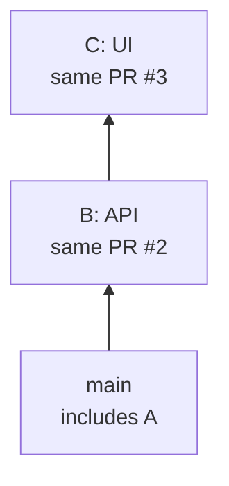

`jj-stack merge` asks GitHub to merge a group of pull requests starting at the bottom of your
stack. Once the PRs have merged, `jj-stack sync` updates your local stack and any remaining
pull requests.

GitHub can perform the merge immediately or put it through a merge queue. An immediate merge
is called a **direct merge**. In both cases, `jj-stack merge` waits for completion and runs
the sync automatically.

## Before merging

If you rewrote one of your changes after submitting it, submit your stack again, even if that
change's diff is unchanged:

```console
jj-stack submit <head-change-id>
jj-stack merge <head-change-id>
```

`jj-stack merge` checks that the changes to merge still match the commits you last submitted and
that their PR branches and pull requests have not moved unexpectedly. GitHub decides whether
checks, approvals, conflicts, and repo rules allow the merge.

`jj-stack list` and `jj-stack view` show review decisions, checks, and specific merge warnings.
`needs review` means GitHub still requires a review.

To inspect unresolved review threads and failed or pending checks, including links, run:

```console
jj-stack view --verbose <head-change-id>
```

Verbose output includes thread excerpts, even for outdated threads.

## Choose a merge method

For a direct merge, `merge` uses your repo's only allowed merge method if there is just one.
With several allowed methods and an unsigned stack, it prefers rebase, then squash, then a merge
commit. Choose an allowed method with `--method`, or set a default once:

```console
jj config set --repo jj-stack.merge_method squash
```

When several methods are allowed and your stack contains signed commits, choose a method with
`--method` or `jj-stack.merge_method` because merging can discard commit signatures. This also
covers changes you aren't merging yet: GitHub may rewrite them when earlier changes are merged.

Rebase and squash replace the original commits and their signatures. GitHub may sign a squash
result with its own key. A merge commit preserves the commits being merged. Choosing a method
does not guarantee that all signatures in the stack survive.

A merge queue chooses its own method, including for signed stacks; `--method` is ignored.

## Choose how much of your stack to merge

By default, `merge` selects consecutive open, non-draft PRs from the bottom of the stack, each
still matching what you submitted. It sends one request for that group. GitHub decides whether
reviews, checks, conflicts, and repo rules allow the group to merge.

If a check or approval blocks that request, `jj-stack` reports the rejection. It does not retry
smaller groups automatically. To merge fewer PRs, select the last PR you want to land with
`--pull-request`.

For example, in A → B → C, suppose the PRs are #1, #2, and #3. To merge only A:

```console
jj-stack merge --pull-request 1 --method squash
```

After the command finishes, PR #1 is merged, PR #2 targets `main`, and PR #3 still targets PR #2's
branch. Both remaining PRs keep their numbers and discussions:



Selecting PR #2 instead asks GitHub to merge A and B together, leaving C open.

Using `--pull-request` lets `jj-stack` merge through the named PR while still updating the
changes above it. With `--pull-request 1`, it merges A and then updates B and C. Passing A's
change ID instead would leave B and C out of the selected stack, so the command would refuse to
proceed because all three PRs belong to the same GitHub stack.

## Finish after GitHub merges

After GitHub merges some or all of your pull requests, `sync` fetches the updated trunk and
rebases your remaining changes onto it. It removes any obsolete local copies of the merged
changes, updates the remaining PRs, and deletes PR branches that are no longer needed. If your
working copy is on a merged change, `sync` first moves it to a new empty change on trunk.

Select the stack by its head change ID or by any linked pull request:

```console
jj-stack sync <head-change-id>
jj-stack sync --pull-request <pr>
```

`sync --pull-request` updates the complete local stack containing the named PR, including
changes above it. The selected PR can already be merged.

If someone pushes a PR's submitted commit straight to trunk instead of merging the PR, `sync`
closes that PR and cleans up, provided the PR is not part of a GitHub stack.

If no PR has merged, no submitted commit has reached trunk, and GitHub has not rebased the stack,
`sync` leaves the pull requests unchanged. Run `jj-stack submit` explicitly when you want to
publish local changes.

After a squash merge, trunk contains a new commit for the merged work, but your remaining
changes may still depend on the original local changes. `sync` rebases that work onto the
squashed result and removes the old copies. Other merge methods also need `sync` to update
the remaining PRs and remove unused branches.

### Merge queues

GitHub tests each queued PR on a temporary merge commit that combines it with the PRs ahead of
it, so those checks appear on that commit rather than on the PR's own Checks tab. While waiting,
`merge` shows each PR's queue position and the state of those checks.

If GitHub removes a PR from the queue, `merge` stops, reports GitHub's reason, links to the
checks on that commit, and names the next step. See [queue removal recovery][queue-removal].

[queue-removal]: ../troubleshooting.md#a-stack-was-removed-from-the-merge-queue

While any selected pull request is queued, `jj-stack submit` refuses to update the stack and
`jj-stack sync` leaves it unchanged; rerun `jj-stack merge` to resume waiting.

### Leaving before GitHub finishes

Use `--no-wait` to return as soon as GitHub accepts the request, or press Ctrl-C to stop
waiting. Neither cancels the request. Rerun the same `jj-stack merge` to keep watching it, or run
`jj-stack sync <head-change-id>` once GitHub finishes.

### Merges outside jj-stack

If you or someone else merged your stack through the GitHub UI, `gh`, or another client, run the
same `sync` command after GitHub reports that the merge finished.

### Rebasing from GitHub

After GitHub's **Rebase stack** action finishes, run `jj-stack sync <head-change-id>` to bring
that rebase into your local stack.

GitHub's rewritten commits do not retain jj change IDs. `jj-stack sync` checks that the PR order
and contents match, rebases your original changes, and updates the PR branches with commits that
retain their change IDs. It stops if local edits or different contents on GitHub prevent a match.

### Several merged stacks

To sync every local stack affected by a completed merge, run:

```console
jj-stack sync --all
```

This also cleans up merged PRs whose local changes are gone. If one stack cannot be updated,
jj-stack explains why and continues with independent stacks.

`sync --all` handles completed merges. To follow up on GitHub's **Rebase stack** action,
name the stack with `sync <head-change-id>`.

## If `merge` fails after GitHub merges your pull requests

A failed local update or network interruption can leave work unfinished after the PRs merge.
Follow the hint in the error. If the local rebase produced conflicts, follow
[sync conflict recovery](../troubleshooting.md#sync-rebased-your-changes-into-conflicts).

If the local update has not finished, inspect the stack and rerun `sync`:

```console
jj-stack view <head-change-id>
jj-stack sync <head-change-id>
```

If only cleanup failed, run the `jj-stack cleanup --pull-request <pr>` commands in the hint.
The hint names each PR because the merged local changes may already be gone.

Your pull requests are already merged, so do not retry `jj-stack merge`.

## When trunk moves without one of your pull requests merging

`jj-stack sync` handles completed GitHub merges and stack rebases. If trunk merely advanced,
fetch it, rebase your changes with `jj` if needed, then submit the rewritten changes:

```console
jj git fetch
jj rebase -b '<change-id>' -o 'trunk()'
jj-stack submit <head-change-id>
```

Use any change in the stack with `-b`; jj finds its base and moves the whole stack, including
forks. You can even omit `-b` to use jj's default of `@`.

Rebase when your work needs the latest trunk or GitHub requires it before merging.
