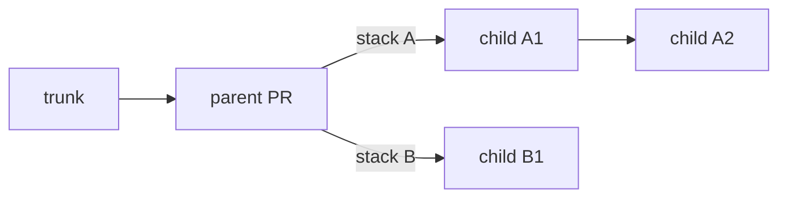

## See every stack

It's quite normal to be working on several projects at once, using a separate stack for each. Use
`list` when you have multiple stacks in flight:

```console
jj-stack list
```

When your working copy is not on your intended stack, copy that stack's head change ID from the
`list` output and pass it to the command:

```console
jj-stack view <head-change-id>
jj-stack submit <head-change-id>
```

### Tracking your local work in `jj`

It's likely that you'll have some stacks in flight that `jj-stack` has not yet seen. In such
cases, some `jj` config like the following can be quite useful. This defines a `jj` alias called
`streams` that displays your local stacks, without any knowledge of `jj-stack`. It highlights
the heads of stacks to make them easier to see.

```toml
[aliases]
# `jj streams` shows all mutable changes, plus the immutable change at
# the base of each line of work.
streams = [
  "log",
  "-r", "mutable() | (parents(mutable()) & immutable())",
  "-T", "stack_log",
]

[template-aliases]
# Use the normal compact log format, but label each non-empty mutable
# tip as a stack head.
stack_log = '''
if(
  self.contained_in("heads(mutable() & ~empty())"),
  label("stack_head", builtin_log_compact(self)),
  builtin_log_compact(self),
)
'''

[colors]
# Display each stack head in bold on a dark green background.
stack_head = { bg = "ansi-color-22", bold = true }
```

## Start a dependent stack

When new work depends on an existing stack but needs to live in its own stack of pull requests,
tell `jj-stack` where the new stack begins:

```console
jj-stack submit --base <parent-change-id> <child-head-change-id>
```

Only your changes after the parent, up to the child head, are submitted. `--base` applies to that
one command, so include it again whenever you update your child stack.



Merge your parent stack first. After it lands, sync it, rebase only the child range onto trunk,
and submit your child stack normally without `--base`.

## Combine independent stacks locally

Sometimes two stacks do not truly depend on each other or need to merge in order; you just need
both present while you work or test them together. Instead of putting one stack on top of the
other, you can keep them independent and create a local *megamerge*: an empty jj merge change
whose parents are the heads of your stacks.

Work and test above the megamerge, but submit and merge each of your underlying stacks separately.
The megamerge is local scaffolding; do not pass it to jj-stack or publish it on GitHub. For a
full walkthrough of megamerges, see Isaac Corbrey's
[Jujutsu megamerges for fun and profit][megamerges].

[megamerges]: https://isaaccorbrey.com/notes/jujutsu-megamerges-for-fun-and-profit

If code in one stack really does depend on another, use a dependent stack instead.

## Look at several of your stacks at once

`view` can inspect several of your stacks in one run without changing them:

```console
jj-stack view first-head --pull-request 42 second-head
```

Commands that make changes still act on one of your stacks at a time. Updating one of your stacks
does not silently update another one.

## Move work between stacks

Submit your change's original stack first, then submit its new stack. This removes your pull
request from the old stack before adding it to the new one. If you try the opposite order,
jj-stack stops without changing anything.
