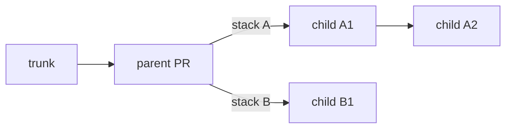
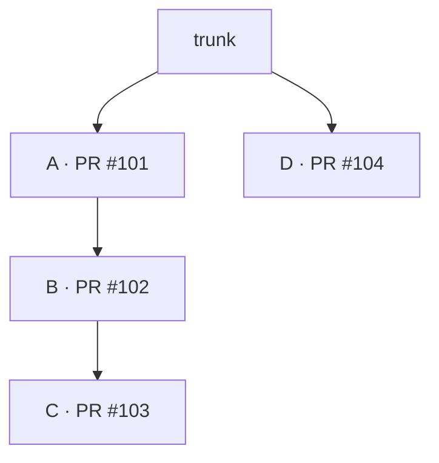
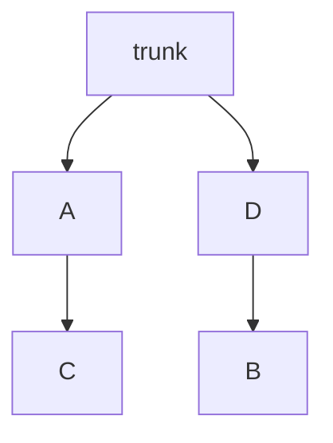
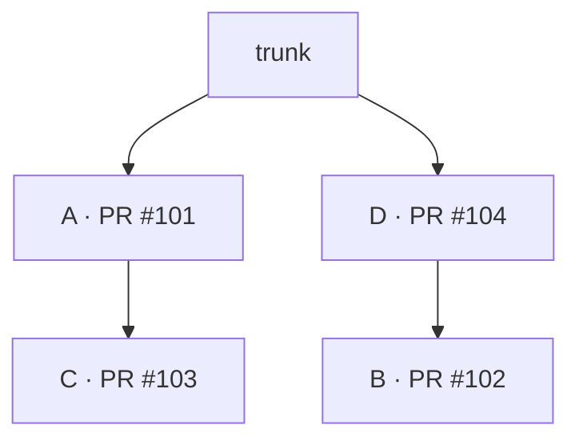

Each linear chain of changes above trunk is its own stack, and each stack is submitted, reviewed,
and merged separately. This guide covers finding the stacks you have submitted, building new work
on a stack that is still under review, testing independent stacks together, and moving a change
from one stack to another.

## See every stack

Use `jj-stack list` to find the stacks you have submitted from this repo:

```console
jj-stack list
```

Copy a stack's head change ID from the output to work with it from any working-copy change:

```console
jj-stack view <head-change-id>
jj-stack submit <head-change-id>
```

`jj-stack list` includes stacks with saved pull request links. To see work you have not submitted
yet, use `jj` directly. This shows all mutable changes and their immediate immutable parents:

```console
jj log -r 'mutable() | (parents(mutable()) & immutable())'
```

## Start a dependent stack

When new work depends on an existing stack but needs its own GitHub stack, use `--base` to name
the parent change it builds on. Submit the parent first, then submit the child stack:

```console
jj-stack submit --base <parent-change-id> <child-head-change-id>
```

Only changes after the parent, up to the child head, are submitted. The parent's PR must be open
and still match its submitted commit. `--base` applies to one command, so repeat it whenever you
update the child stack. Omitting it includes the parent changes in the submission.



Merge the parent before merging the child stack. Once the change named by `--base` has merged,
sync the parent stack. Then rebase the child changes onto trunk and submit them without `--base`:

```console
jj rebase -r '<child-bottom-change-id>::<child-head-change-id>' -o 'trunk()'
jj-stack submit <child-head-change-id>
```

Select only the child's changes for this rebase, even if more work remains in the parent stack.

## Combine independent stacks locally

To test independent stacks together, create a local *megamerge*: an empty jj merge change whose
parents are the stack heads. This lets you work with both stacks without making either depend on
the other.

Work and test above the megamerge, but submit and merge each underlying stack separately. Keep
the megamerge local; jj-stack accepts only linear stacks. For a walkthrough, see Isaac Corbrey's
[Jujutsu megamerges for fun and profit][megamerges].

[megamerges]: https://isaaccorbrey.com/notes/jujutsu-megamerges-for-fun-and-profit

If code in one stack really does depend on another, use a dependent stack instead.

## Look at several of your stacks at once

`jj-stack view` can inspect several stacks in one run:

```console
jj-stack view first-head --pull-request 42 second-head
```

`jj-stack submit` and `jj-stack merge` act on one selected stack. To apply completed merges
across the repo, use [`jj-stack sync --all`](merge-and-sync.md#several-merged-stacks).

## Move work between stacks

During review, you may discover that a change belongs with another piece of work. Suppose you
have submitted changes A, B, and C as one stack, and D as a separate PR. B now needs code from
D, while C does not need B. You want to move B onto D and leave A and C together.

Before the move, your local changes and their PRs are arranged like this. Arrows run from a
parent to the change built on it; the PR numbers are examples:



You can update the existing PRs to follow this move. For example, B will still use PR #102,
with its existing discussion and review history, but that PR will target D's branch instead of
A's. You do not need to close PR #102 or open a replacement.

### Move B locally

Replace the placeholders below with the change IDs from `jj log`:

```console
jj rebase -r <B-change-id> --insert-after <D-change-id>
```

The `-r` option moves B alone. `jj` rebases C onto A, leaving these two local stacks:



Resolve any conflicts before continuing. This rebase changes only your local history; the PRs
on GitHub still have the arrangement shown in the first diagram.

### Update the original stack on GitHub first

B's PR still belongs to the original GitHub stack with A and C. Submitting the new stack ending
at B cannot also update A and C: those changes are outside the stack you selected. jj-stack
stops that submission to avoid breaking up a different GitHub stack without updating it.

First, submit the original stack, which now ends at C:

```console
jj-stack submit <C-change-id>
```

This updates the GitHub stack to contain A and C, with C's PR targeting A's branch. B's PR
leaves that stack but stays open, ready to join D's stack.

Now submit the stack ending at B:

```console
jj-stack submit <B-change-id>
```

This updates B's PR to target D's branch and creates the GitHub stack containing D and B.
GitHub now matches your local history, using the same four PRs:



If you already tried submitting B first and got an error, submit C, then retry B.
