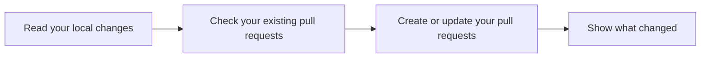

Use `submit` whenever your local stack is the version you want GitHub to show.

## Submit the current stack

Submit your stack:

```console
jj-stack submit
```



## Titles and descriptions

For each of your changes, the subject becomes its pull request title and the rest of the
description becomes the body. If there is no body, `submit` tries the repository pull request
template.

You can review everything in your preferred editor before anything is pushed:

```console
jj-stack submit --edit
```

You can supply Markdown as the pull request description for one of your changes:

```console
jj-stack submit --describe <change-id>=pr-body.md
```

If your stack has several changes, you can use `--describe stack=overview.md` to create an
overview comment on your head pull request. See
[pull request descriptions](../reference/descriptions.md) for helper programs and validation
rules.

The `--describe` option is particularly useful for coding agents.

## Drafts and readying PRs for review

When you `submit`, you can create your new pull requests as drafts:

```console
jj-stack submit --draft
```

This does not affect the draft status of your existing pull requests. Use `--draft=all` to return
them to draft, or `--open` to mark them as ready to review. With `--edit`, each of your changes
has its own editable draft choice.

## Reviewers and labels

When choosing reviewers and labels for one of your pull requests or your whole stack, `jj-stack`
starts with repository defaults from your `jj` config. It then adds any reviewers and labels you
name on the command line.

After addressing review or automation feedback, you can request another look from reviewers who
previously approved or asked for changes (i.e. revoking the approved state of your PRs):

```console
jj-stack submit --re-request
```

## What the `submit` command changes

| Surface | Effect |
|---|---|
| Local `jj` history | Not rewritten |
| Review branches | Created or updated |
| Pull requests | Created or updated |
| Pull request order | Updated to match the local change order |
| Other local stacks | Not changed |

With `jj`, you can easily move your changes between existing stacks. However, GitHub allows each
of your pull requests to belong to only one stack. `jj-stack` therefore has to move your pull
request out of its old stack before moving it into its new one.

If you get into such a state, `jj-stack submit` stops and tells you which of your stacks to submit
first.

For the exact contract between local history and edits made in the GitHub UI, see
[work with a stack on GitHub](working-on-github.md).

(If you wanted to get pathological, you could move commit A from stack 1 to stack 2, and commit
B from stack 2 to stack 1, in which case any automated stack surgery would start to get complex.
`jj-stack submit` does *not* try to detect or deal with cases like this. If you really need to
make complex changes to your stacks, do it step by step.)
