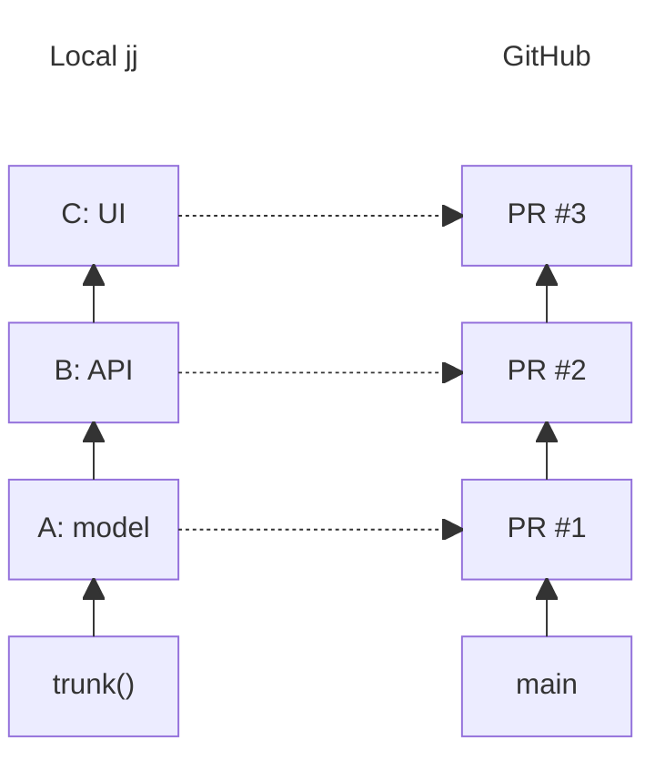
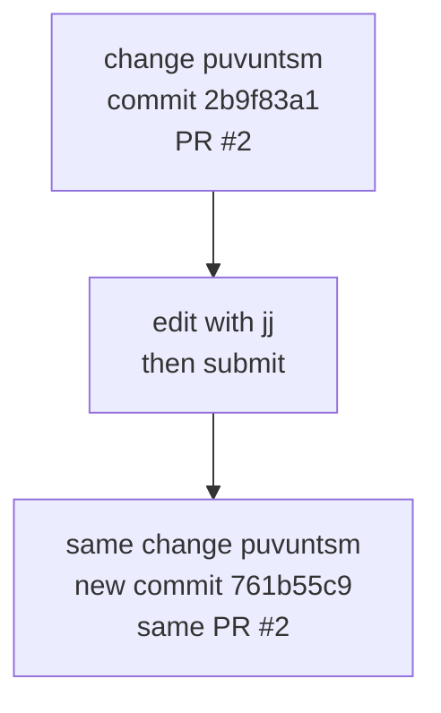
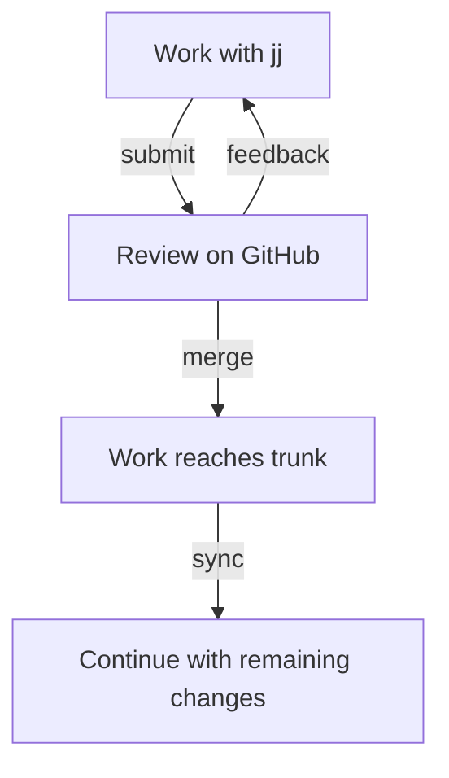

A stack is a linear chain of local `jj` changes. Use `jj` to write and rearrange those changes,
then run `jj-stack submit` to create or update one GitHub pull request per change.

## One change, one pull request

Suppose you refactor a model in A, build an API on it in B, and add a UI in C. Submitting that
chain produces three pull requests in the same order:



The bottom PR targets trunk, usually `main`, and each PR above it targets the PR branch below.
This means PR #2's diff shows just the API changes added in B, since the refactor in A is
already in its base. Reviewers can consider each change separately while you keep working on
the changes that depend on it.

GitHub needs a branch for every PR. `jj-stack` creates and updates those PR branches for you,
and they normally stay out of local bookmark output. When you submit two or more changes,
`jj-stack` also groups their PRs into a GitHub stack. A single change gets an ordinary PR.

## Select a stack by its head

The head is the top change in your stack. When you select C, `jj-stack` follows its parents
back to trunk to find the whole chain, A → B → C. Trunk is the base of the stack and is not
included. You don't need bookmarks to define the stack, and adding one to B won't divide it.

If you don't specify a head, `jj-stack` starts from your working copy (`@`), provided it has
both a description and changes. Otherwise, it uses the parent (`@-`). With an empty working
copy above C, for example, `jj-stack submit` submits the chain ending at C.

If you edit B directly, select C explicitly to update the whole stack:

```console
jj edit <B-change-id>
# edit files
jj-stack submit <C-change-id>
```

The change you're editing is B, but the stack still ends at C. Passing C's ID to `submit`
selects the whole A → B → C stack. You can inspect it with `jj-stack view <C-change-id>`.
Use `jj-stack list` to find the heads of stacks you've already submitted.

See [bookmarks and selection](reference/bookmarks-and-selection.md) for selection rules,
or [multiple stacks](guides/multiple-stacks.md#start-a-dependent-stack) to submit dependent work
separately with `--base`.

## Editing a change keeps its pull request

A `jj` change keeps its change ID when you edit or reorder it, even though rewriting it gives
it a new Git commit ID. `jj-stack` uses the change ID to find the existing PR, so submitting
again preserves the PR number, discussion, and review history.



When you edit B, `jj` also rebases C onto the new B. Submitting the stack updates both PR
branches. See [edit and rearrange](guides/revise.md) for splitting, squashing, or abandoning
submitted changes.

## Submit, review, merge, and sync



After you publish your changes with `jj-stack submit`, review takes place on GitHub as usual.
When you're ready to land the stack, `jj-stack merge` asks GitHub to merge it from the bottom.
Use `--pull-request <pr>` to stop at an earlier PR. GitHub decides whether its checks and
review rules allow the requested group to merge.

`jj-stack merge` waits for GitHub, including its merge queue, then rebases your remaining
changes onto the updated trunk, updates their PRs to match, and removes PR branches that are no
longer needed. Run `jj-stack sync <head-change-id>` yourself only after `--no-wait`, an
interrupted wait, a merge made through GitHub, or GitHub's **Rebase stack** action, once GitHub
has finished.

To rebase onto newer trunk changes at any other time, use `jj rebase`, then publish the result
with `jj-stack submit`. See [merge and sync](guides/merge-and-sync.md) for partial merges and
queues.

## When jj-stack is unsure, it stops

Before updating a PR, `jj-stack` checks that it can safely match it to the intended local change.
If more than one PR could match, or a branch has moved unexpectedly, it stops and explains what
to do next. See [working on GitHub](guides/working-on-github.md) for which edits you can make
there and how they interact with your local work.
