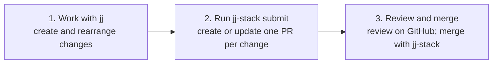
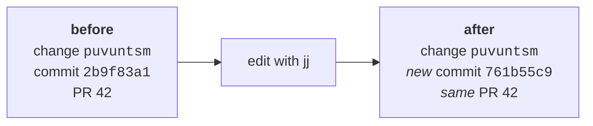

The short version: create and rearrange your changes with `jj`, then run `jj-stack submit` to
bring your pull requests up to date on GitHub.

## The whole workflow

### Local work

Use familiar `jj` commands to create, split, squash, reorder, rebase, or abandon your changes.
Their order determines the order of your pull requests on GitHub.

### Each of your changes becomes one pull request

When you first submit your work, `jj-stack` creates one pull request for each of your changes,
then adds your pull requests to a GitHub stack.

### Review on GitHub, merge with jj-stack

Use GitHub as usual for comments, approvals, checks, repository rules, and merge queues. When
your stack is ready, `jj-stack merge` asks GitHub to merge it and updates your local `jj`
changes.

## Editing a change keeps its pull request

A `jj` change ID is a persistent identifier for a change as you edit it. The underlying Git
commit ID changes every time you update your work. `jj-stack` follows a change ID, and ensures
that a matching PR is created, updated, reordered, or removed on GitHub.

In this example, the existing comments and review history stay on PR 42 even though the Git
commit ID has changed.

## You do not manage review branches

GitHub requires a branch for every pull request. `jj-stack` creates and updates these branches
for you. Review branches are normally hidden from local `jj` output, and you do not need to
think about Git branches to arrange your stacks.

## When jj-stack is unsure, it stops

Before updating anything, `jj-stack` checks that it can safely match each of your local changes
to the right pull request. If it cannot, it stops with an error and tells you what to inspect and
what to do next.
