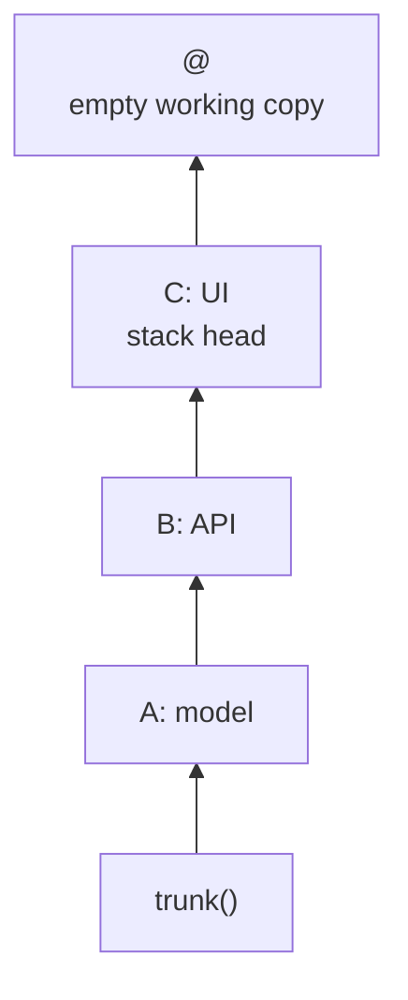
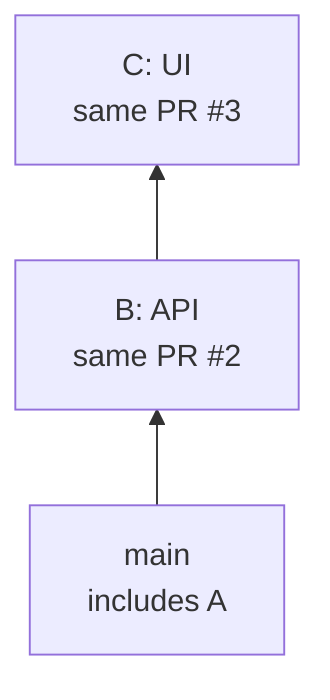

In this walkthrough, you'll submit three changes as a stack of GitHub pull requests, revise
the middle change, and merge the first PR while the others stay open. The examples call these
changes A, B, and C. Follow along with three changes of your own.

## Install

You need Python 3.14 or newer, `jj` 0.45.1 or newer, and a GitHub repo you can push to.
Install `jj-stack` with [`uv`](https://docs.astral.sh/uv/):

```console
uv tool install jj-stack
```

<details>
<summary>Other installation options</summary>

You can also install with `pipx install jj-stack`, or use `python -m pip install jj-stack`
inside an activated virtual environment.

To upgrade a `uv` installation, run `uv tool upgrade jj-stack`. If your shell cannot find
`jj-stack`, run `uv tool update-shell`.

</details>

If you use the GitHub CLI and have not signed in, run:

```console
gh auth login
```

`jj-stack` can use that login, or a token in `GITHUB_TOKEN` or `GH_TOKEN`. GitHub stacked PRs are
in [public preview](https://docs.github.com/en/pull-requests/tutorials/roll-out-stacked-prs) and
require no repo or organization setup.

Inside your `jj` repo, check its remote, trunk, and GitHub access:

```console
jj-stack doctor --fix
```

The `--fix` option configures your repo so that `jj-stack`'s PR branches stay out of ordinary
fetches and local bookmark output. Resolve any remaining failed checks before continuing.

## Build A → B → C

Start a fresh line of work above trunk:

```console
jj new 'trunk()'
```

Make your first change, then run `jj commit` to give it a description and start a new working
copy above it. Repeat this for the other two changes:

```console
# edit files
jj commit -m "A: refactor shared model"
# edit files
jj commit -m "B: add API"
# edit files
jj commit -m "C: add UI"
```

Your history now has three changes above trunk and an empty working copy above C:



Run `jj log` to find the change IDs for B and C. You'll use them later to edit B and submit
the stack with C at its head.

## Inspect and submit

Run `jj-stack` with no subcommand to see your stack:

```console
jj-stack
```

You'll see A, B, and C, with no pull requests yet. Because your working copy is empty,
`jj-stack` uses its parent, C, as the top of the stack.

Submit your stack for review:

```console
jj-stack submit
```

The output now shows one PR per change. We'll call them PRs #1, #2, and #3, though GitHub will
assign different numbers in your repo:

| Change | Pull request | Base | What reviewers see |
|---|---|---|---|
| A: refactor shared model | #1 | `main` | The model refactor |
| B: add API | #2 | PR #1's branch | The API changes relative to A |
| C: add UI | #3 | PR #2's branch | The UI changes relative to B |

`submit` creates the PR branches and groups these PRs into a GitHub stack. Each change's subject
becomes its PR title, and the rest of its description supplies the body.

If your terminal has hyperlink support (such as
[Ghostty](https://ghostty.org/docs/vt/external),
[iTerm2](https://iterm2.com/documentation-escape-codes.html), or
[kitty](https://sw.kovidgoyal.net/kitty/conf/#opt-kitty.allow_hyperlinks)), you can click the PR
number beside `Top of stack` to open it on GitHub.

## Revise B while C depends on it

Suppose a reviewer asks for an API correction. Replace the placeholders below with the change
IDs from `jj log`:

```console
jj edit <B-change-id>
# edit files
jj-stack submit <C-change-id>
```

`jj edit` takes the change you want to edit. `jj-stack submit` takes the top of the stack you
want to publish. Here, you edit B but pass C to submit the whole A → B → C stack.

Inspect the result:

```console
jj-stack view <C-change-id>
```

The output should still list PRs #1, #2, and #3, and their discussions remain on GitHub.
PR #1 is unchanged, while PRs #2 and #3 now point to the new commits for B and C. Even though
you edited only B, C also needed a new commit because its parent changed.

In `submit`'s output, `pushed` means the PR branch received the new commit. `PR unchanged`
means its title, body, and other PR details needed no update.

## Merge A and keep working on B and C

Once A meets the repo's review and check requirements, you can merge its PR. Replace `1` with
its PR number in your repo. This example uses squash merging, but you can choose another
method if your repo requires it:

```console
jj-stack merge --pull-request 1 --method squash
```

The `--pull-request` option names the last PR you want to merge, starting from the bottom of
the stack. Here, choosing PR #1 merges only A. Choosing PR #2 would ask GitHub to merge A and
B together.

If GitHub performs the merge immediately, without a merge queue, this is called a **direct
merge**. The command then fetches the result and rebases B and C onto the updated trunk. It
also updates their existing PRs to match:



PR #1 is merged. PR #2 now targets `main`, and PR #3 still targets PR #2's branch. Run
`jj-stack view <C-change-id>` to check that only B and C remain in the local stack.

If your repo uses a merge queue, the queue chooses the merge method and `--method` is ignored.
The command returns when GitHub accepts the request into the queue. Wait until GitHub reports
the merge complete, then run:

```console
jj-stack sync <C-change-id>
```

You also need to run `sync` after merging through GitHub's UI or using its **Rebase stack**
action. Wait for GitHub to finish before running the command.

To continue from the top, create a fresh scratch change above C:

```console
jj new <C-change-id>
```

You can now add another change, or keep revising B and C. Run `jj-stack submit` whenever
you're ready to publish those changes for review.

## What next?

- Read [how jj-stack works](mental-model.md) for selection, change IDs, and PR branches.
- Follow [submit and update](guides/submit-and-update.md) for drafts and reviewer requests.
- Read [merge and sync](guides/merge-and-sync.md) for merge methods, queues, and recovery.
- Set up the optional
  [`jj stack` alias and shell completion](reference/configuration.md#invoke-it-as-jj-stack).
