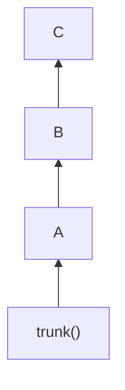
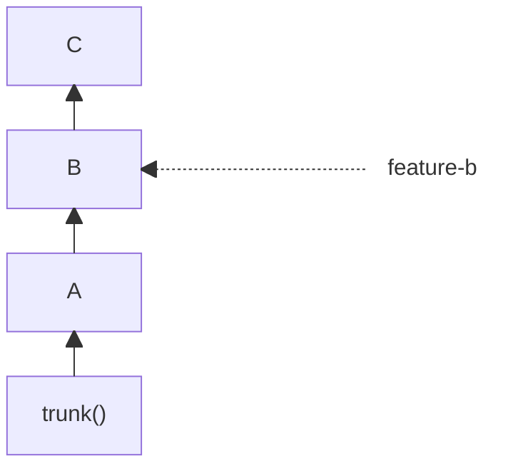

jj-stack finds stacks by following the parent relationships in `jj`. You do not need to create
bookmarks for individual changes or for the stack as a whole.

## How jj-stack finds a stack

Suppose your local history looks like this:



If `C` is selected as the head, `jj-stack` walks back through its parents until it reaches
`trunk()`. The stack contains `A`, `B`, and `C`; the change at `trunk()` is the base and is not
part of the stack.

By default, `view`, `submit`, `merge`, and `sync` select `@` as the head, or `@-` if `@` is empty
or has no description. To select a different stack, pass its head change ID:

```console
jj-stack view <head-change-id>
jj-stack submit <head-change-id>
```

`jj-stack list` shows the head change ID of each tracked stack. A change ID continues to identify
the same logical change after you edit or rebase it, even though its Git commit ID changes.

## A bookmark does not divide a stack

Now suppose the bookmark `feature-b` points to `B`:



Selecting `C` still selects `A`, `B`, and `C`. The bookmark neither divides the stack nor changes
which pull request belongs to each change.

Passing the bookmark as an argument selects `B` as the head:

```console
jj-stack view feature-b
jj-stack submit feature-b
```

These commands select `A` and `B`. `C` is above the selected head and is left out.

## `view` can find the stack containing a change

`jj-stack view` treats a bare change ID differently from a bookmark or other revset. A change ID
asks for the complete stack containing that change. In the example above:

```console
jj-stack view <B-change-id>
```

shows `A`, `B`, and `C`, while:

```console
jj-stack view feature-b
```

shows only `A` and `B` because the bookmark selects `B` as the head.

If two visible stack heads descend from `B`, both stacks contain it. In that case, `view`
stops and asks for a more precise selection. You can pass the change ID of your intended head,
or pass a bookmark or other revision expression that resolves to that head.

For `submit`, select the stack by its head change ID. A middle change or a bookmark selects only
the lower part of the stack, and `submit` stops if GitHub already groups the whole stack as one.

`merge` follows the same rules, so a middle change selects only the lower part of the stack, and
`merge` stops in the same case. To merge only the bottom of a stack, name the last PR to merge
with `--pull-request <pr>` instead. See
[merge and sync](../guides/merge-and-sync.md#choose-how-much-of-your-stack-to-merge).

## PR branches are separate from your bookmarks

jj-stack creates and updates the Git branches that GitHub needs for PRs, normally with names
beginning with `jj-stack/`. These are separate from your ordinary bookmarks, even when a bookmark
points to the same change.

The managed PR branches normally stay out of local bookmark output. Do not create, move, or
delete bookmarks in the `jj-stack/` namespace yourself. See
[Configuration](configuration.md#pr-branch-names) if you need to choose a different namespace
before your first submit.

## When a bookmark makes a change immutable

jj-stack submits visible, mutable changes. With jj's default immutability rules, a local bookmark
does not make its target immutable, but an untracked remote bookmark can. jj-stack respects your
`immutable_heads()` configuration.

An immutable base at `trunk()` is expected. If a change inside the stack is immutable, jj-stack
stops before submitting or rewriting it.

Use `jj bookmark list --all-remotes` to see whether a remote bookmark points to the change. If
so, handle that bookmark through your normal `jj` workflow. For example, track it if it is a
branch you intend to work on, or move your mutable changes onto the intended base with `jj`.

If PR bookmarks in the `jj-stack/` namespace appear in your local output, run
`jj-stack doctor --fix` to remove untracked PR bookmarks and keep them out of future fetches.
If the change is still immutable, inspect other remote bookmarks, tags, and your
`immutable_heads()` configuration before deciding how to proceed.
